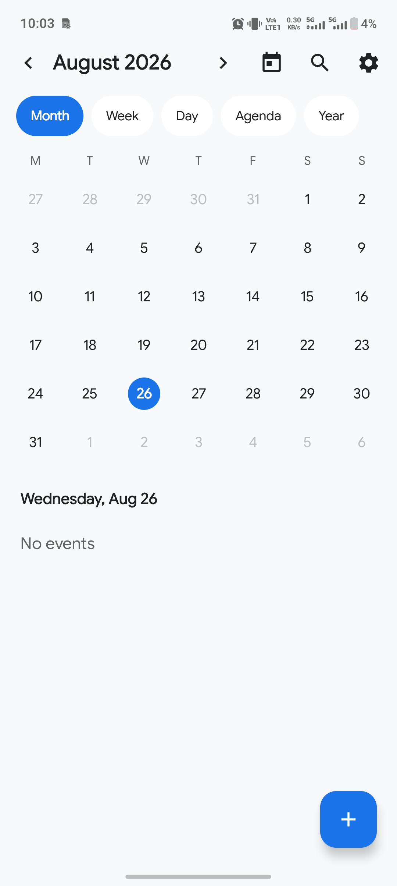
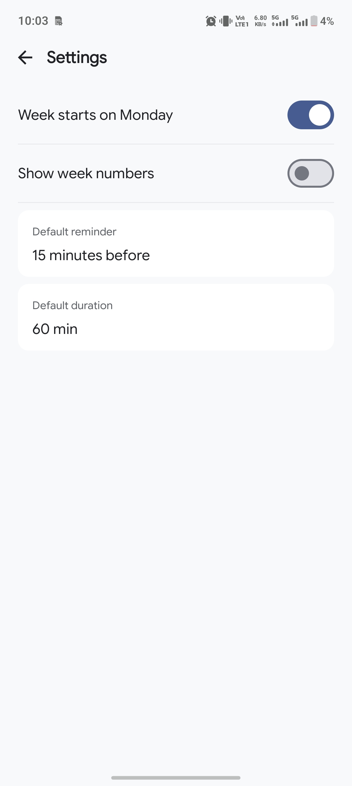
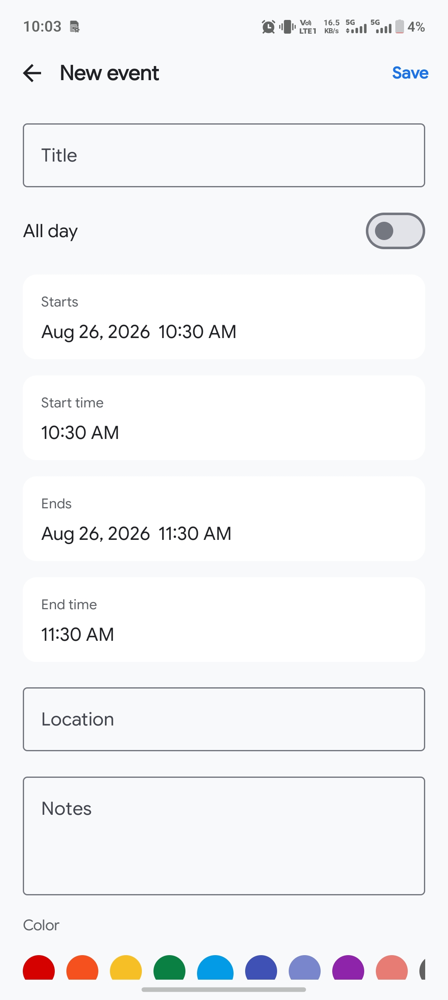
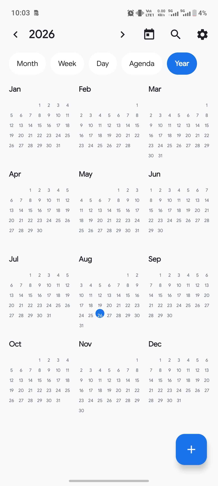

# Calendar App

A clean and modern Android calendar app built with Kotlin and Jetpack Compose.

## Overview

Calendar App provides a simple and intuitive way to view dates, navigate through the calendar, and keep track of your schedule.

## Features

- Clean calendar interface
- Monthly calendar view
- Easy date navigation
- Selected date highlighting
- Simple and responsive UI
- Modern Material 3 design

## Tech Stack

- Kotlin
- Jetpack Compose
- Material 3
- Android

## About

Designed and developed independently as a compact Android project, focusing on a clean interface and smooth calendar experience.

## Screenshots

  
  

  
  

